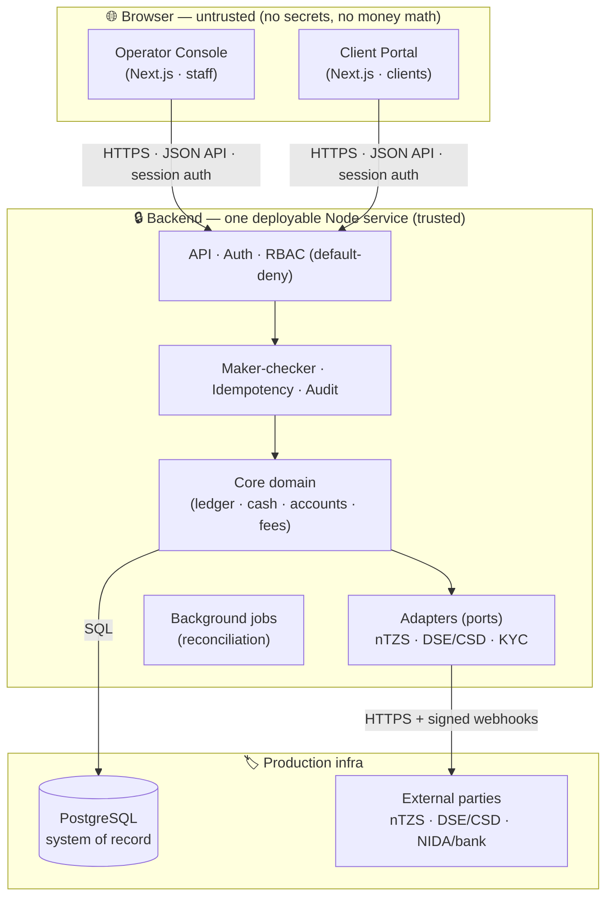

# Architecture — FIMCO Broker Back Office

This document defines **what is frontend, what is backend, and what is production**, and the
boundaries between them. Read [`CLAUDE.md`](./CLAUDE.md) for the domain rules and the
non-negotiable money-movement invariants first.

## The one rule that drives everything

**All money and position logic, validation, authorization, and secrets live in the backend.**
The frontend is presentation only — it calls the backend API and renders the result. The
browser is never trusted: hiding a button is UX, not a security control; the same check is
always enforced server-side. Money is never computed in the browser, and no secret (the
`ntzs_*` key, webhook secret, DB credentials) ever reaches frontend code.

## Trust boundaries

## Backend — the one deployable service

A **modular monolith** (CLAUDE.md): one Node service, one transactional Postgres DB. It is the
only thing that touches money, positions, and secrets. Internally it is layered:

| Layer | Package | Responsibility |
|---|---|---|
| HTTP edge | `apps/api` | Fastify routes, request validation, auth (OIDC/SSO), RBAC (default-deny), nTZS webhook endpoint, background jobs |
| Domain | `packages/core` | Ports + business logic: securities ledger, cash ledger + treasury + mirror, accounts + holdings, reconciliation, maker-checker, audit. In-memory reference impls so it runs offline. |
| Integrations | `packages/adapters` | Real outside-world clients implementing core ports: nTZS HTTP `CashLedger`, webhook verifier/receiver. (DSE/CSD/KYC adapters land as specs arrive.) |
| Primitives | `packages/shared` | Money (integer minor units), typed ids, idempotency, errors. No dependencies. |

**Dependency direction is strictly inward:** `apps/api → adapters → core → shared`. `core` never
imports `adapters`; that is why the in-memory reference implementations live in `core`.

### The two-ledger model (see CLAUDE.md)

1. **Securities ledger — we own it.** Append-only, event-sourced (orders, executions,
   positions). The audit trail is a by-product of the event log.
2. **Cash ledger — delegated to nTZS.** We never move shillings directly; we instruct the nTZS
   API and mirror the returned on-chain tx reference. A daily reconciliation job proves our
   mirror matches live nTZS balances.

A trade is **settled only when both legs reconcile** (CSD stock leg + nTZS cash-leg webhook).

## Frontend — two thin React apps

Both are Next.js apps that talk only to the backend API via a typed client
(`packages/api-client`) and share a component library (`packages/ui`).

- **`apps/web-operator`** — internal tool for back-office staff (onboarding approvals,
  maker-checker queues, reconciliation breaks, reporting).
- **`apps/web-portal`** — internet-facing site for clients (balances, holdings, statements,
  deposit/withdrawal requests).

They are **separate deployables** on purpose: the client portal faces the public internet while
the operator console is internal-only. Separating them shrinks the attack surface and lets each
be secured, scaled, and deployed independently.

## Production

Production = the backend service + PostgreSQL + the two frontends, deployed with:

- **AuthN/AuthZ:** OIDC/SSO sign-in; default-deny RBAC; maker-checker enforced in the domain.
- **Data:** PostgreSQL as system of record (append-only ledgers; idempotency key written in the
  same transaction as its side effect). Backups + a tested restore (RTO/RPO).
- **Secrets:** from a secrets manager / env, backend-only. Never in code, logs, or the frontend.
- **Observability:** structured logs (no PII/secrets), metrics, traces; reconciliation-break
  alerts wired to a real channel.
- **Environments:** local → test → staging → prod, each with its own config and nTZS **test**
  keys (production uses `ntzs_live_`).
- **Security gates:** dependency + secret + SAST scanning in CI; an independent penetration test
  before go-live.
- **Hosting / data residency:** **BLOCKED** pending the CMSA ruling (Discovery item 1) — this
  determines the deploy region/target.

## Build & run

- Monorepo via **npm workspaces**. `npm install` at the root links everything.
- `npm run typecheck` — whole-repo typecheck on source (path aliases, no build needed).
- `npm run test` — Vitest across all packages (resolves `@fimco/*` to source).
- `npm run build` — `tsc -b` project-reference build to each package's `dist/`.
- See [`docs/adr/`](./docs/adr) for the decisions behind this structure.
